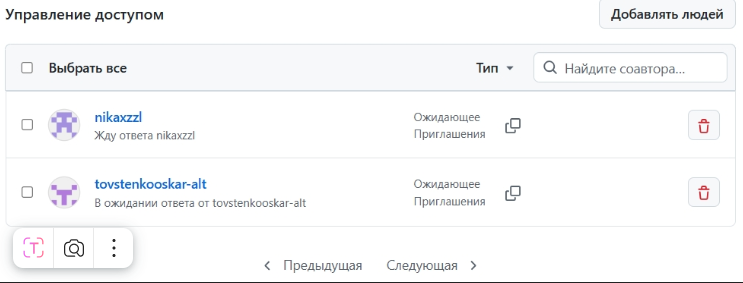

# Практическая работа: совместная разработка на GitHub

## Состав команды
| Участник | GitHub | Роль |
|---|---|---|
| ФИО | Булаева Ева | Владелец репозитория |
| ФИО | Булаева Ева | Разработчик |
| ФИО | Кононова Ника | Разработчик |
| ФИО | Товстенко Оскар | Проверяющий |
## Цель работы
Научиться работать в команде на GitHub

## Используемые инструменты
- Git;
- GitHub;
- VS Code.

## Ход работы
### 1. Создание репозитория и добавление участников
Вставить описание и скриншот.

### 2. Клонирование проекта
Каждый участник команды клонировал репозиторий на свой компьютер через VS Code.

### 3. Первый push
Участник 1 добавил файл и отправил на GitHub

### 4. Работа с изменениями других участников
Участники получили изменения участнbка 1, затем каждый добави свой файл. 

### 5. Ошибка при Push без Pull
Участник 3 отправил изменение, хоть не нажал перед этим Pull.

### 6. Merge conflict
участник 1 и 2 изменили одну и ту же строчку по-разному в README и возник конфликт. решали конфликт вручную.

### 7. Работа с ветками
Каждый участник создал отдельную ветку для своих изменений:
- Участник 2: feature/about-page
- Участник 3: feature/features-page
- Участник 4: feature/contacts-page

### 8. Pull Request
Ника проверяла
Участники создали 

### 9. Конфликт в Pull Request
Объединить два Pull Request в один файл из-за этого возник конфликт. Мы разрешили его, объединив оба изменения в итоговом тексте

### 10. Fetch и Pull
Fetch позволяет увидеть, что на GitHub появились новые изменения, но не
применяет их сразу к локальным файлам. Pull получает изменения и сразу
объединяет их с текущей рабочей версией.

## История коммитов
в скриншотах добавлен файл коммитов.

## Вывод
В ходе практической работы мы  изучилм совместную разработку на GitHub. Мы научились добавлять участников в репозиторий, клонировать проекты, создавать коммиты и работать с ветками. Основными проблемами стали конфликты слияния и ошибки при отправке изменений без предварительного Pull. Самым сложным этапом оказалось решение ошибок. Ветки и Pull Request оказались полезными для отделением изменений и их проверки перед объединением. Выполнение Pull перед началом работы позволяет избежать конфликтов и работать с актуальной версией проекта.

# team-github-practice2
## Описание
Это учебный командный проект для практики GitHub.
## Проблема: забыли сделать Pull
Мы увидели, что если участник работает со старой версией проекта, Git может не
разрешить отправить изменения сразу. Сначала нужно получить актуальную версию
с GitHub, объединить изменения и только потом отправлять свои.
## Статус проекта
Проект находится в активной разработке командой студентов: команда студентов изучает GitHub, Pull Request и разрешение конфликтов.
## Проблема: merge conflict
Мы получили конфликт, потому что два участника изменили одну и ту же строку в
README.md. Git не смог автоматически выбрать правильный вариант, поэтому мы
вручную объединили изменения.
## Версия проекта
Текущая версия: 1.0.0
## Разница между Fetch и Pull
Fetch позволяет увидеть, что на GitHub появились новые изменения, но не
применяет их сразу к локальным файлам. Pull получает изменения и сразу
объединяет их с текущей рабочей версией.

Вопросы
1. Что такое репозиторий?
Репозиторий— это специализированная структура данных, предназначенная для хранения файлов и каталогов проекта, а также связанных с ними метаданных и полной хронологической истории всех изменений, внесенных в эти файлы под управлением системы контроля версий.

2. Чем локальный репозиторий отличается от удаленного?
Локальный репозиторий находится на вашем личном компьютере. Именно в нем вы пишете код, сохраняете изменения (делаете коммиты) и экспериментируете. Удаленный репозиторий находится на сервере (например, на GitHub, GitLab или Bitbucket). Он служит общим центром синхронизации для команды: туда разработчики отправляют свой готовый код и оттуда скачивают изменения коллег.

3. Что делает команда Pull?
Команда git pull скачивает новые изменения из удаленного репозитория и сразу же автоматически сливает их с вашей текущей локальной веткой, обновляя ваши файлы до актуального состояния. 

4. Что делает команда Push?
Команда git push делает обратное
она загружает ваши локальные коммиты (сохраненные изменения) в удаленный репозиторий, чтобы они стали доступны другим участникам проекта.

5. Чем Fetch отличается от Pull?
git fetch работает деликатно
команда только скачивает информацию обо всех изменениях с удаленного сервера, но не трогает ваши локальные файлы. Вы можете посмотреть, что сделали коллеги, прежде чем внедрять это к себе. git pull — это более агрессивная команда. Фактически, это git fetch, за которым сразу же автоматически следует git merge (слияние).

6. Что такое ветка?
Ветка (branch) — это независимая линия разработки. Это как создать копию вашего проекта на определенный момент времени, чтобы спокойно вносить изменения, не ломая основную версию кода. 

7. Почему не всегда удобно работать сразу в main?
Ветка main (или master) 
считается "лицом" проекта — там должен лежать только стабильный, рабочий код, готовый к релизу. Если все разработчики будут писать сырой код прямо в main, проект постоянно будет в сломанном состоянии, а отследить, кто и что сломал, станет невозможно. Для каждой новой задачи или исправления бага создается отдельная ветка. 

8. Что такое Pull Request?
это запрос на слияние вашей рабочей ветки с основной (например, main). Это специальный интерфейс на платформах вроде GitHub, где команда может просмотреть ваши изменения кода, обсудить их и одобрить перед тем, как они попадут в главный проект.

9. Зачем нужна проверка Pull Request другим участником?
Это процесс называется Code Review (ревью кода). Он нужен для того, чтобы: Найти ошибки и баги, которые "замылившийся" глаз автора мог пропустить. Убедиться, что код соответствует стандартам качества команды. Поделиться знаниями (младшие учатся у старших, а разработчики узнают, как работают разные части системы). 

10. Что такое merge conflict?
Конфликт слияния — это ситуация, когда Git не может автоматически объединить изменения из разных веток и 
останавливает процесс слияния, требуя вмешательства человека. 

11. Почему возникает merge conflict?
Git запутается и выдаст конфликт в двух основных случаях: Два человека изменили одну и ту же строку в одном и том же файле по-разному. Один человек изменил файл, а другой человек в своей ветке этот же файл удалил. Git не обладает искусственным интеллектом, чтобы решить, чья логика правильнее, поэтому просит вас сделать выбор.

12. Как понять, какой вариант кода оставить при конфликте?
При конфликте Git помечает проблемные участки кода специальными символами.
Чтобы решить конфликт, вам нужно: 
1. Изучить оба варианта изменения
2. Обсудить с командой.

13. Что будет, если забыть сделать Pull перед началом работы?
Будет вылезать старая ошибка из-за старых данных.

14. Почему коммиты должны быть маленькими и понятными?
Потому что в коммитах самое главное - информация.

15. Что было самым сложным в этой практической работе?
самым слодным оказалось решение ошибок, возникающих при pull/push